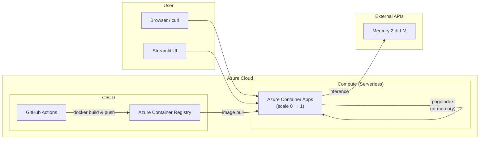

# 🧠 Serverless DiffusionRAG Pipeline

> A cost-optimized, cloud-native **Retrieval-Augmented Generation** API that combines vectorless retrieval (PageIndex) with a diffusion-based LLM (Mercury 2), deployed on serverless Azure infrastructure that scales to zero.

[](https://github.com/kbpr21/Serverless-DiffusionRAG-Pipeline/actions/workflows/deploy.yml)

---

## Architecture



**Flow:** User uploads a document → FastAPI parses & indexes it with PageIndex (in-memory, no vector DB) → User asks a question → relevant context is retrieved → Mercury 2 generates an answer.

---

## Tech Stack

| Layer | Technology | Why |
|---|---|---|
| **Backend** | Python / FastAPI | Async, high-performance API framework |
| **Retrieval** | VectifyAI PageIndex | Vectorless tree-based retrieval — zero embedding costs |
| **LLM** | Mercury 2 (Inception Labs) | Diffusion-based model — ultra-low latency inference |
| **IaC** | Terraform | Declarative, reproducible Azure provisioning |
| **Container** | Docker | Consistent builds across dev and cloud |
| **Registry** | Azure Container Registry | Private image storage |
| **Compute** | Azure Container Apps | Serverless, scales to zero for $0 idle cost |
| **CI/CD** | GitHub Actions | Automated build-push-deploy on every `git push main` |
| **Frontend** | Streamlit | Lightweight Python chat UI |

---

## Local Development Quickstart

### Prerequisites
- Python 3.10+, Docker Desktop, Terraform CLI, Azure CLI

### 1. Clone & Configure
```bash
git clone https://github.com/kbpr21/Serverless-DiffusionRAG-Pipeline.git
cd Serverless-DiffusionRAG-Pipeline
cp .env.example .env
# Edit .env and fill in your MERCURY_API_KEY
```

### 2. Run the API
```bash
python -m venv venv
.\venv\Scripts\activate        # Windows
pip install -r requirements.txt
uvicorn app.main:app --reload
```
The API is live at `http://localhost:8000`. Try `GET /health`.

### 3. Run the Streamlit Frontend
```bash
streamlit run frontend/app.py
```
Open `http://localhost:8501`, upload a document, and start chatting.

### 4. Docker
```bash
docker build -t diffusion-rag:local .
docker run -p 8000:8000 --env-file .env diffusion-rag:local
```

---

## Terraform Provisioning

```bash
cd terraform
terraform init
terraform plan        # Review what will be created
terraform apply       # Provision Azure resources
```

This creates: Resource Group → Container Registry → Container Apps Environment → Container App (scale 0–1).

---

## CI/CD Pipeline

Every push to `main` triggers `.github/workflows/deploy.yml`:

1. **Checkout** code
2. **Login** to Azure via Service Principal
3. **Build & Push** Docker image to ACR (tagged with commit SHA)
4. **Deploy** new revision to Azure Container Apps

> **Note:** Uses `docker build/push` instead of `az acr build` because Azure Student subscriptions block ACR Tasks.

---

## API Reference

| Method | Endpoint | Description | Body |
|---|---|---|---|
| `GET` | `/health` | Health check | — |
| `POST` | `/upload` | Upload & index a PDF/TXT | `multipart/form-data` with `file` field |
| `POST` | `/query` | Ask a question about an uploaded document | `{"question": "...", "document_id": "..."}` |

### Example

```bash
# Upload
curl -X POST http://localhost:8000/upload -F "file=@document.pdf"
# → {"document_id": "abc123", "filename": "document.pdf", "page_count": 5}

# Query
curl -X POST http://localhost:8000/query \
  -H "Content-Type: application/json" \
  -d '{"question": "What is this about?", "document_id": "abc123"}'
# → {"answer": "...", "model": "mercury-2"}
```

---

## Environment Variables

| Variable | Required | Description |
|---|---|---|
| `MERCURY_API_KEY` | ✅ | API key for Mercury 2 dLLM |
| `RAG_API_ENDPOINT` | Frontend only | ACA URL for Streamlit to call |
| `CORS_ORIGINS` | Optional | Comma-separated allowed origins (default: `http://localhost:8501`) |

---

## License

This project is for educational and portfolio demonstration purposes.
